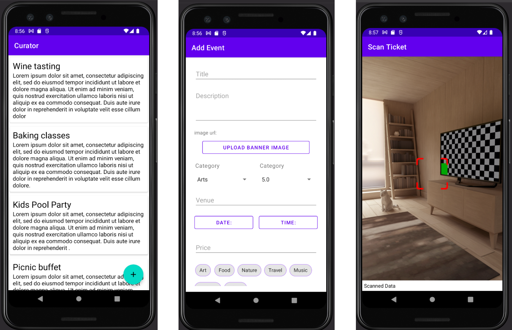

# Bucket list curator app
An application for curators to add and manage events on Bucket list. 


## Description
This is an app for organizers of events and fun activities for [BucketList](https://github.com/KAbaidoo/BucketList). 
It enables users to manage events, including verifying QR code tickets. 
The app uses [Firebase](https://firebase.google.com/docs) as a backend including:
[Cloud Firestore](https://firebase.google.com/docs/firestore) for the main database
and [Cloud Storage](https://firebase.google.com/docs/storage) for file storage.
The QR code scanner was implemented using [CamView](https://github.com/LivotovLabs/CamView) library.
The app works on phones running Android version 5.0 (API level 21) and above.

Some of the features that was successfully implemented are listed below.

### Features
- Manage events.
- QR code scanner.

## Installation
Clone this repository and import into **Android Studio**
```
git clone https://github.com/KAbaidoo/bucketList-curator.git

```
### Generating signed APK
From Android Studio:
1. Build menu
2. Generate Signed APK...
3. Fill in the keystore information (you only need to do this once manually and then let Android Studio remember it).

## Usage
1. Add and Delete events
2. Scan QR code tickets to verify.


### Screenshots


## Further Work
- Signup and registration
- Management of sales
- Show ticket owner

## License
[MIT](https://choosealicense.com/licenses/mit/)


